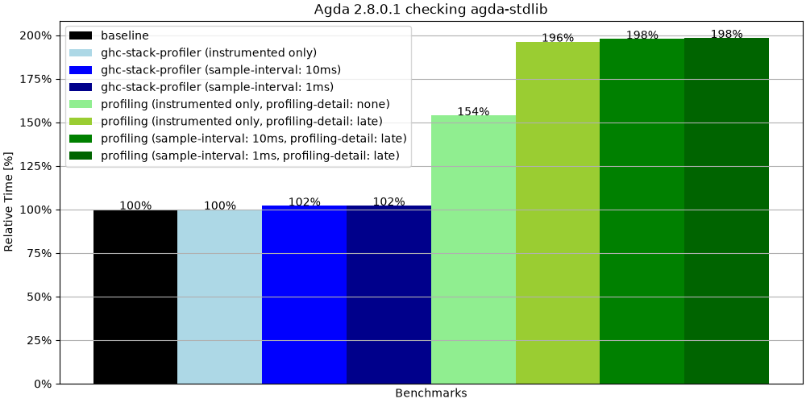

# Overview

## Versioning

The super-major version number of all `ghc-stack-profiler` packages in this repository is used to indicate the protocol version. For instance, if `ghc-stack-profiler` has version `A.B.C.D` then it supports the protocol version `A`. The `ghc-stack-profiler-core` package implements the protocol and makes no effort to be backwards compatible, which means that if you use `ghc-stack-profiler` version `^>= 1`, you must process its eventlogs with `ghc-stack-profiler-speedscope` version `^>= 1`. This means that whenever `ghc-stack-profiler-core` changes the protocol, new versions of all three packages must be released.

## Publishing a release

1.  Ensure that the current HEAD is ready to be published:
    - The version number is updated in all relevant places.
      For `ghc-stack-profiler`, this includes at least:
      - `ghc-stack-profiler/ghc-stack-profiler.cabal`
      - `ghc-stack-profiler/CHANGELOG.md`

    - The Haddock documentation builds without warnings and renders without errors.
    - The tests pass on CI.

2.  Create a Git tag of the form `${VERSION}`, e.g., `0.5.0.0`:

    ```sh
    git tag ${VERSION}
    ```

    > ⚠️ **Warning:** Replace `${VERSION}` with the new version.

    > ⚠️ **Warning:** We have moved away from requiring lockstep releases. If you're making the first non-lockstep release, please migrate to Git tags of the form `${PACKAGE_NAME}-v${VERSION}` and update these instructions.

3.  Publish the Git tag:

    ```sh
    git push --tags
    ```

4.  If you are publishing a release for `ghc-stack-profiler`, you must update the README, which is included in its source distribution.

    To ensure that the images render on Hackage, replace the links to the local assets with permanent links to the Git tag you created in step (2).

    ```diff
    - 
    + 
    ```

    > ⚠️ **Warning:** Do not forget the `?raw=true` at the end.

    > ⚠️ **Warning:** Do not commit these changes.

    > ℹ️ **Tip:**
    > As an alternative, you can replace these links with a permalink to the first commit that introduced them, and commit these changes.
    > If you take this approach, this step serves as a reminder to check that there are no links to local assets in the README.

5.  Build the source distribution.

    ```sh
    cabal sdist ghc-stack-profiler
    ```

    > ℹ️ **Tip:** This writes the source distribution to `dist-newstyle/sdist/`.

6.  Upload the source distribution to Hackage _as a package candidate_
    - Navigate to <https://hackage.haskell.org/packages/candidates/upload>.
    - Upload the source distribution built in the previous step.

7.  Ensure that the package candidate page has no errors.

8.  Ensure that the `CHANGELOG.md` has no errors.

9.  Publish the candidate package.
    - On the package candidate package, click on _"[Publish]"_ and confirm.
